Environmental Epidemiology Mini-Project
================
Saud Hamad
2025-12-31

- [**Data Dictionary**](#data-dictionary)
  - [**Load Packages**](#load-packages)
  - [**Load Raw Data**](#load-raw-data)
  - [**Table 1**](#table-1)
  - [**Clean Data and Recode Factors**](#clean-data-and-recode-factors)
  - [**Descriptive Statistics & EDA** & **Correlation Analysis of
    Numeric
    Variables**](#descriptive-statistics--eda--correlation-analysis-of-numeric-variables)
  - [**Survival Analysis
    (Kaplan-Meier)**](#survival-analysis-kaplan-meier)
  - [**Cox Proportional Hazards
    Models**](#cox-proportional-hazards-models)
  - [**Helper Function for Forest
    Plots**](#helper-function-for-forest-plots)
  - [**Visualize Model Results (Forest
    Plots)**](#visualize-model-results-forest-plots)

1.  Project Overview This project analyzes the association between
    environmental noise exposure (road traffic and aircraft noise) and
    the incidence of hypertension in a cohort based in Rome. The
    analysis follows a standard epidemiological workflow:

- Descriptive Statistics: Baseline characteristics of the cohort.

- Exploratory Data Analysis: Distribution of noise exposure and
  correlations.

- Survival Analysis: Kaplan-Meier estimates for hypertension-free
  survival.

- Cox Proportional Hazards Modeling: Estimating Hazard Ratios (HR) for
  different noise sources while adjusting for confounders (Age, BMI,
  Smoking, etc.).

- Diagnostics: Verifying model assumptions.

# **Data Dictionary**

The following variables are used in this analysis:

| Variable | Description |
|:---|:---|
| `ht_incid` | Incident Hypertension (1 = Yes, 0 = No) |
| `time_ht` | Time to event (months) |
| `noise_night_air_bs` | Night-time aircraft noise level (dB) at baseline |
| `noise_day_air_bs` | Day-time aircraft noise level (dB) at baseline |
| `noise_allday_road_bs` | All-day road traffic noise level (dB) at baseline |
| `age` | Age in years |
| `gender` | Participant gender (Female or Male) |
| `bmi_bs` | Body Mass Index (kg/m²) at baseline |
| `smoke_bs` | Binary variable (yes/no) on whether the participant was a smoker at baseline. |
| `alcohol_bs` | Alcohol consumption (units/week) at baseline |
| `saltconsumption_bs` | Frequency of adding salt at the table |
| `education_bs` | Highest education level attained (4 categories) |
| `exercise` | Frequency of physical activity (Never to \>3 times/week) |
| `open_windows_bs` | Habitual window opening behavior (Yes or No) |

## **Load Packages**

``` r
# 1. Install / Load necessary libraries
packages <- c("tidyverse", "survival", "survminer", "broom", "readr", "car", "tableone", "corrplot")

# Check and install missing packages
new_packages <- packages[!(packages %in% installed.packages()[,"Package"])]
if(length(new_packages)) install.packages(new_packages)

# Load libraries
library(tidyverse)
library(survival)
library(survminer)
library(broom)
library(readr)
library(car)
library(tableone)
library(corrplot)
```

## **Load Raw Data**

``` r
# 2. Data Import and Initial Inspection
home.dir <- paste0(dirname(rstudioapi::getSourceEditorContext()$path), "/")
data <- read_csv(paste0(home.dir, "CohortDataRome.csv"))
# View structure and summary
glimpse(data) # Data Glimpse
```

    ## Rows: 1,590
    ## Columns: 24
    ## $ id                   <dbl> 1, 2, 3, 4, 5, 6, 7, 8, 9, 10, 11, 12, 13, 14, 15…
    ## $ area                 <dbl> 2, 2, 2, 2, 2, 2, 2, 2, 2, 2, 2, 2, 2, 2, 2, 2, 2…
    ## $ gender               <chr> "female", "male", "male", "female", "male", "male…
    ## $ age                  <dbl> 50, 67, 58, 53, 47, 67, 57, 62, 48, 71, 55, 53, 5…
    ## $ smoke_bs             <chr> "yes", "no", "yes", "yes", "yes", "no", "yes", "y…
    ## $ alcohol_bs           <dbl> 18, 4, 15, 4, 1, 3, 9, 10, 3, 10, 5, 11, 0, 15, 5…
    ## $ saltconsumption_bs   <chr> "sometimes,seldom.never add salt at the table", "…
    ## $ noise_night_air_bs   <dbl> 48.5, 54.0, 50.1, 47.7, 45.2, 48.6, 39.1, 45.0, 4…
    ## $ noise_allday_road_bs <dbl> 77.2, 61.5, 76.1, 62.0, 55.9, 60.9, 69.6, 54.2, 4…
    ## $ noise_day_air_bs     <dbl> 75.0, 74.4, 72.7, 72.0, 71.9, 71.9, 71.8, 71.5, 7…
    ## $ education_bs         <chr> "19 years or more", "12-15 years", "19 years or m…
    ## $ bmi_bs               <dbl> 28.80365, 27.88656, 30.80724, 30.54613, 28.92002,…
    ## $ exercise             <chr> "Never", "Never", "3 times a week or more", "Neve…
    ## $ open_windows_bs      <dbl> 1, 0, 0, 0, 1, 1, 1, 1, 0, 1, 1, 0, 1, 1, 0, 0, 0…
    ## $ ht_incid             <dbl> 1, 0, 0, 0, 0, 0, 0, 0, 0, 1, 0, 0, 0, 0, 0, 1, 1…
    ## $ time_ht              <dbl> 70, 114, 114, 114, 114, 114, 114, 114, 114, 59, 1…
    ## $ cardarr_incid        <dbl> 0, 1, 0, 1, 1, 0, 0, 1, 0, 0, 0, 0, 0, 0, 1, 0, 0…
    ## $ time_cardarr         <dbl> 114, 56, 114, 70, 32, 114, 114, 68, 114, 114, 114…
    ## $ mi_incid             <dbl> 0, 1, 1, 0, 0, 0, 0, 1, 0, 0, 0, 0, 0, 0, 0, 0, 0…
    ## $ time_mi              <dbl> 114, 81, 71, 114, 114, 114, 114, 75, 114, 114, 11…
    ## $ hearprob_incid       <dbl> 0, 1, 0, 0, 1, 1, 0, 0, 0, 0, 0, 1, 0, 0, 0, 1, 0…
    ## $ time_hearprob        <dbl> 114, 95, 114, 114, 76, 24, 114, 114, 114, 114, 11…
    ## $ hearimp_incid        <dbl> 0, 1, 0, 1, 1, 1, 0, 0, 1, 1, 0, 1, 1, 0, 1, 1, 0…
    ## $ time_hearimp         <dbl> 114, 77, 114, 60, 70, 69, 114, 114, 40, 65, 114, …

``` r
summary(data) # Data summary
```

    ##        id              area      gender               age       
    ##  Min.   :   1.0   Min.   :2   Length:1590        Min.   :31.00  
    ##  1st Qu.: 398.2   1st Qu.:2   Class :character   1st Qu.:51.00  
    ##  Median : 795.5   Median :2   Mode  :character   Median :59.00  
    ##  Mean   : 795.5   Mean   :2                      Mean   :58.29  
    ##  3rd Qu.:1192.8   3rd Qu.:2                      3rd Qu.:66.00  
    ##  Max.   :1590.0   Max.   :2                      Max.   :81.00  
    ##                                                  NA's   :19     
    ##    smoke_bs           alcohol_bs     saltconsumption_bs noise_night_air_bs
    ##  Length:1590        Min.   : 0.000   Length:1590        Min.   :22.60     
    ##  Class :character   1st Qu.: 2.000   Class :character   1st Qu.:38.30     
    ##  Mode  :character   Median : 5.000   Mode  :character   Median :42.50     
    ##                     Mean   : 8.498                      Mean   :42.02     
    ##                     3rd Qu.:10.000                      3rd Qu.:45.90     
    ##                     Max.   :76.000                      Max.   :59.70     
    ##                     NA's   :21                                            
    ##  noise_allday_road_bs noise_day_air_bs education_bs           bmi_bs     
    ##  Min.   : 0.40        Min.   :24.60    Length:1590        Min.   :15.05  
    ##  1st Qu.:28.50        1st Qu.:48.52    Class :character   1st Qu.:25.05  
    ##  Median :39.70        Median :54.65    Mode  :character   Median :27.75  
    ##  Mean   :38.92        Mean   :53.34                       Mean   :28.28  
    ##  3rd Qu.:48.60        3rd Qu.:59.00                       3rd Qu.:30.95  
    ##  Max.   :77.20        Max.   :75.00                       Max.   :60.70  
    ##  NA's   :7                                                NA's   :4      
    ##    exercise         open_windows_bs     ht_incid         time_ht      
    ##  Length:1590        Min.   :0.0000   Min.   :0.0000   Min.   : 16.00  
    ##  Class :character   1st Qu.:0.0000   1st Qu.:0.0000   1st Qu.: 81.25  
    ##  Mode  :character   Median :1.0000   Median :0.0000   Median :114.00  
    ##                     Mean   :0.5767   Mean   :0.2849   Mean   : 99.13  
    ##                     3rd Qu.:1.0000   3rd Qu.:1.0000   3rd Qu.:114.00  
    ##                     Max.   :1.0000   Max.   :1.0000   Max.   :114.00  
    ##                                                                       
    ##  cardarr_incid     time_cardarr      mi_incid         time_mi     
    ##  Min.   :0.0000   Min.   : 24.0   Min.   :0.0000   Min.   : 22.0  
    ##  1st Qu.:0.0000   1st Qu.:114.0   1st Qu.:0.0000   1st Qu.:114.0  
    ##  Median :0.0000   Median :114.0   Median :0.0000   Median :114.0  
    ##  Mean   :0.2288   Mean   :101.8   Mean   :0.2023   Mean   :104.3  
    ##  3rd Qu.:0.0000   3rd Qu.:114.0   3rd Qu.:0.0000   3rd Qu.:114.0  
    ##  Max.   :1.0000   Max.   :114.0   Max.   :1.0000   Max.   :114.0  
    ##  NA's   :8        NA's   :8       NA's   :8        NA's   :8      
    ##  hearprob_incid   time_hearprob   hearimp_incid     time_hearimp
    ##  Min.   :0.0000   Min.   : 13.0   Min.   :0.0000   Min.   : 14  
    ##  1st Qu.:0.0000   1st Qu.: 91.0   1st Qu.:0.0000   1st Qu.:114  
    ##  Median :0.0000   Median :114.0   Median :0.0000   Median :114  
    ##  Mean   :0.2836   Mean   :100.5   Mean   :0.2396   Mean   :103  
    ##  3rd Qu.:1.0000   3rd Qu.:114.0   3rd Qu.:0.0000   3rd Qu.:114  
    ##  Max.   :1.0000   Max.   :114.0   Max.   :1.0000   Max.   :114  
    ## 

``` r
str(data)     # Data structure
```

    ## spc_tbl_ [1,590 × 24] (S3: spec_tbl_df/tbl_df/tbl/data.frame)
    ##  $ id                  : num [1:1590] 1 2 3 4 5 6 7 8 9 10 ...
    ##  $ area                : num [1:1590] 2 2 2 2 2 2 2 2 2 2 ...
    ##  $ gender              : chr [1:1590] "female" "male" "male" "female" ...
    ##  $ age                 : num [1:1590] 50 67 58 53 47 67 57 62 48 71 ...
    ##  $ smoke_bs            : chr [1:1590] "yes" "no" "yes" "yes" ...
    ##  $ alcohol_bs          : num [1:1590] 18 4 15 4 1 3 9 10 3 10 ...
    ##  $ saltconsumption_bs  : chr [1:1590] "sometimes,seldom.never add salt at the table" "always" "always" "sometimes,seldom.never add salt at the table" ...
    ##  $ noise_night_air_bs  : num [1:1590] 48.5 54 50.1 47.7 45.2 ...
    ##  $ noise_allday_road_bs: num [1:1590] 77.2 61.5 76.1 62 55.9 ...
    ##  $ noise_day_air_bs    : num [1:1590] 75 74.4 72.7 72 71.9 ...
    ##  $ education_bs        : chr [1:1590] "19 years or more" "12-15 years" "19 years or more" "12 years or less" ...
    ##  $ bmi_bs              : num [1:1590] 28.8 27.9 30.8 30.5 28.9 ...
    ##  $ exercise            : chr [1:1590] "Never" "Never" "3 times a week or more" "Never" ...
    ##  $ open_windows_bs     : num [1:1590] 1 0 0 0 1 1 1 1 0 1 ...
    ##  $ ht_incid            : num [1:1590] 1 0 0 0 0 0 0 0 0 1 ...
    ##  $ time_ht             : num [1:1590] 70 114 114 114 114 114 114 114 114 59 ...
    ##  $ cardarr_incid       : num [1:1590] 0 1 0 1 1 0 0 1 0 0 ...
    ##  $ time_cardarr        : num [1:1590] 114 56 114 70 32 114 114 68 114 114 ...
    ##  $ mi_incid            : num [1:1590] 0 1 1 0 0 0 0 1 0 0 ...
    ##  $ time_mi             : num [1:1590] 114 81 71 114 114 114 114 75 114 114 ...
    ##  $ hearprob_incid      : num [1:1590] 0 1 0 0 1 1 0 0 0 0 ...
    ##  $ time_hearprob       : num [1:1590] 114 95 114 114 76 24 114 114 114 114 ...
    ##  $ hearimp_incid       : num [1:1590] 0 1 0 1 1 1 0 0 1 1 ...
    ##  $ time_hearimp        : num [1:1590] 114 77 114 60 70 69 114 114 40 65 ...
    ##  - attr(*, "spec")=
    ##   .. cols(
    ##   ..   id = col_double(),
    ##   ..   area = col_double(),
    ##   ..   gender = col_character(),
    ##   ..   age = col_double(),
    ##   ..   smoke_bs = col_character(),
    ##   ..   alcohol_bs = col_double(),
    ##   ..   saltconsumption_bs = col_character(),
    ##   ..   noise_night_air_bs = col_double(),
    ##   ..   noise_allday_road_bs = col_double(),
    ##   ..   noise_day_air_bs = col_double(),
    ##   ..   education_bs = col_character(),
    ##   ..   bmi_bs = col_double(),
    ##   ..   exercise = col_character(),
    ##   ..   open_windows_bs = col_double(),
    ##   ..   ht_incid = col_double(),
    ##   ..   time_ht = col_double(),
    ##   ..   cardarr_incid = col_double(),
    ##   ..   time_cardarr = col_double(),
    ##   ..   mi_incid = col_double(),
    ##   ..   time_mi = col_double(),
    ##   ..   hearprob_incid = col_double(),
    ##   ..   time_hearprob = col_double(),
    ##   ..   hearimp_incid = col_double(),
    ##   ..   time_hearimp = col_double()
    ##   .. )
    ##  - attr(*, "problems")=<externalptr>

## **Table 1**

``` r
# Define variables
vars <- c("gender", "age", "smoke_bs", "alcohol_bs", "saltconsumption_bs",
          "noise_night_air_bs", "noise_allday_road_bs", "noise_day_air_bs",
          "education_bs", "bmi_bs", "exercise", "open_windows_bs",
          "median_follow_up")

catVars <- c("gender", "smoke_bs", "education_bs", "exercise", "open_windows_bs")

# Create Table 1
tbl1_t1 <- CreateTableOne(vars = vars, data = data, factorVars = catVars,
                          includeNA = TRUE)

# Print Table 1
print(tbl1_t1, exact = "stage", quote = FALSE, noSpaces = TRUE, showAllLevels = TRUE)
```

    ##                                   
    ##                                    level                                       
    ##   n                                                                            
    ##   gender (%)                       female                                      
    ##                                    male                                        
    ##   age (mean (SD))                                                              
    ##   smoke_bs (%)                     no                                          
    ##                                    yes                                         
    ##   alcohol_bs (mean (SD))                                                       
    ##   saltconsumption_bs (%)           always                                      
    ##                                    sometimes,seldom.never add salt at the table
    ##                                    <NA>                                        
    ##   noise_night_air_bs (mean (SD))                                               
    ##   noise_allday_road_bs (mean (SD))                                             
    ##   noise_day_air_bs (mean (SD))                                                 
    ##   education_bs (%)                 12-15 years                                 
    ##                                    12 years or less                            
    ##                                    15-18 years                                 
    ##                                    19 years or more                            
    ##                                    <NA>                                        
    ##   bmi_bs (mean (SD))                                                           
    ##   exercise (%)                     1-3 times a week                            
    ##                                    3 times a week or more                      
    ##                                    Never                                       
    ##                                    Once a week or less                         
    ##                                    <NA>                                        
    ##   open_windows_bs (%)              0                                           
    ##                                    1                                           
    ##                                   
    ##                                    Overall      
    ##   n                                1590         
    ##   gender (%)                       825 (51.9)   
    ##                                    765 (48.1)   
    ##   age (mean (SD))                  58.29 (9.98) 
    ##   smoke_bs (%)                     743 (46.7)   
    ##                                    847 (53.3)   
    ##   alcohol_bs (mean (SD))           8.50 (10.75) 
    ##   saltconsumption_bs (%)           712 (44.8)   
    ##                                    871 (54.8)   
    ##                                    7 (0.4)      
    ##   noise_night_air_bs (mean (SD))   42.02 (5.54) 
    ##   noise_allday_road_bs (mean (SD)) 38.92 (13.31)
    ##   noise_day_air_bs (mean (SD))     53.34 (8.39) 
    ##   education_bs (%)                 377 (23.7)   
    ##                                    199 (12.5)   
    ##                                    371 (23.3)   
    ##                                    636 (40.0)   
    ##                                    7 (0.4)      
    ##   bmi_bs (mean (SD))               28.28 (4.81) 
    ##   exercise (%)                     391 (24.6)   
    ##                                    374 (23.5)   
    ##                                    487 (30.6)   
    ##                                    304 (19.1)   
    ##                                    34 (2.1)     
    ##   open_windows_bs (%)              673 (42.3)   
    ##                                    917 (57.7)

``` r
# Calculate follow-up mean and SD
mean_follow_up <- mean(data$time_ht / 12)
sd_follow_up <- sd(data$time_ht / 12)
```

## **Clean Data and Recode Factors**

``` r
# 3. Data Cleaning and Recoding
data <- data %>%
  filter(!is.na(noise_allday_road_bs) & !is.na(age) & !is.na(alcohol_bs) & !is.na(bmi_bs)) %>%
  mutate(
    gender             = factor(gender, levels = c("female", "male")),
    smoke_bs           = factor(smoke_bs, levels = c("no", "yes"), labels = c("Non-smoker", "Smoker")),
    open_windows_bs    = ifelse(open_windows_bs == "1", "Yes", "No"),
    education_bs       = factor(education_bs, levels = c("12 years or less", "12-15 years", "15-18 years", "19 years or more")),
    exercise           = factor(exercise, levels = c("Never", "Once a week or less", "1-3 times a week", "3 times a week or more"), ordered = TRUE)
  )

data$ht_incid <- as.numeric(data$ht_incid)

# Relevel and set contrasts
data$education_bs <- relevel(data$education_bs, ref = "12 years or less")
contrasts(data$education_bs) <- "contr.treatment"
data$exercise <- factor(data$exercise, ordered = FALSE)
data$exercise <- relevel(data$exercise, ref = "Never")
contrasts(data$exercise) <- "contr.treatment"
```

## **Descriptive Statistics & EDA** & **Correlation Analysis of Numeric Variables**

``` r
# 4. Install/load corrplot if needed
if (!requireNamespace("corrplot", quietly = TRUE)) install.packages("corrplot")
library(corrplot)

# Create numeric versions of ordered factors
data <- data %>%
  mutate(
    exercise_num   = as.integer(exercise) - 1,
    education_num  = as.integer(education_bs) - 1,
    age            = as.numeric(age),
    alcohol_bs     = as.numeric(alcohol_bs),
    bmi_bs         = as.numeric(bmi_bs),
    noise_night_air_bs  = as.numeric(noise_night_air_bs),
    noise_allday_road_bs= as.numeric(noise_allday_road_bs),
    noise_day_air_bs    = as.numeric(noise_day_air_bs)
  )

# 5. Exploratory analysis
# Summary table by incident HT
data %>%
  group_by(ht_incid) %>%
  summarise(
    n = n(), # Count
    mean_age = mean(age), # Mean age
    prop_female = mean(gender == "female"), # Proportion female
    mean_bmi = mean(bmi_bs) # Mean BMI
  )
```

    ## # A tibble: 2 × 5
    ##   ht_incid     n mean_age prop_female mean_bmi
    ##      <dbl> <int>    <dbl>       <dbl>    <dbl>
    ## 1        0  1103     57.9       0.512     28.1
    ## 2        1   436     59.1       0.530     28.6

``` r
# Histograms of noise exposures
ggplot(data, aes(noise_night_air_bs)) + geom_histogram(binwidth = 2)
```

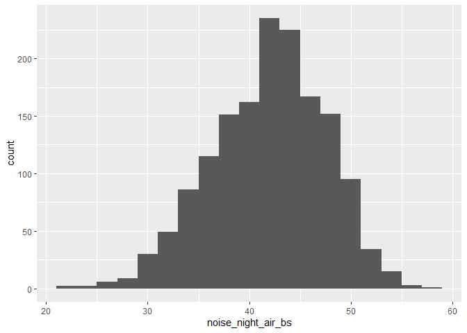<!-- -->

``` r
ggplot(data, aes(noise_allday_road_bs)) + geom_histogram(binwidth = 2)
```

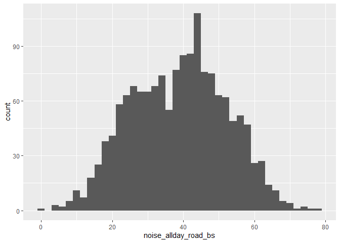<!-- -->

``` r
ggplot(data, aes(noise_day_air_bs)) + geom_histogram(binwidth = 2)
```

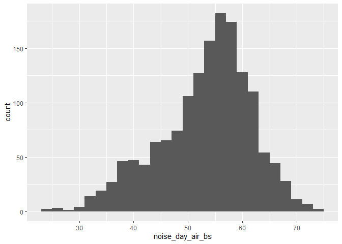<!-- -->

``` r
# Correlation plot of numeric variables
num_vars <- data %>% select(age, alcohol_bs, bmi_bs,
                            noise_night_air_bs, noise_allday_road_bs,
                            noise_day_air_bs, exercise_num, education_num)
corr_mat <- cor(num_vars, use = "complete.obs")
corrplot(corr_mat, method = "color", type = "upper",
         tl.col = "black", tl.srt = 45, addCoef.col = "black", number.cex = 0.7, diag = FALSE)
```

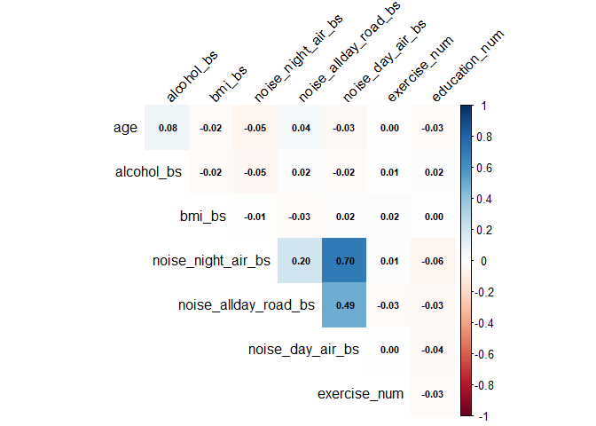<!-- -->

``` r
# T-tests for noise exposures by HT incidence
t.test(data$noise_allday_road_bs ~ data$ht_incid)
```

    ## 
    ##  Welch Two Sample t-test
    ## 
    ## data:  data$noise_allday_road_bs by data$ht_incid
    ## t = -2.2406, df = 794.34, p-value = 0.02533
    ## alternative hypothesis: true difference in means between group 0 and group 1 is not equal to 0
    ## 95 percent confidence interval:
    ##  -3.1827827 -0.2102343
    ## sample estimates:
    ## mean in group 0 mean in group 1 
    ##        38.38033        40.07683

``` r
t.test(data$noise_day_air_bs ~ data$ht_incid)
```

    ## 
    ##  Welch Two Sample t-test
    ## 
    ## data:  data$noise_day_air_bs by data$ht_incid
    ## t = -1.4753, df = 798.02, p-value = 0.1405
    ## alternative hypothesis: true difference in means between group 0 and group 1 is not equal to 0
    ## 95 percent confidence interval:
    ##  -1.643141  0.233062
    ## sample estimates:
    ## mean in group 0 mean in group 1 
    ##        53.12638        53.83142

``` r
t.test(data$noise_night_air_bs ~ data$ht_incid)
```

    ## 
    ##  Welch Two Sample t-test
    ## 
    ## data:  data$noise_night_air_bs by data$ht_incid
    ## t = -0.14407, df = 793.09, p-value = 0.8855
    ## alternative hypothesis: true difference in means between group 0 and group 1 is not equal to 0
    ## 95 percent confidence interval:
    ##  -0.6649631  0.5740311
    ## sample estimates:
    ## mean in group 0 mean in group 1 
    ##        41.96600        42.01147

## **Survival Analysis (Kaplan-Meier)**

``` r
# 4. Kaplan-Meier analysis ----

# Create survival object
surv_obj <- with(data, Surv(time_ht, ht_incid))

# Overall Kaplan-Meier fit
km_all <- survfit(surv_obj ~ 1)
km_summary <- summary(km_all)

# Plot Kaplan-Meier curve
ggsurvplot(
  km_all, data = data, risk.table = TRUE, conf.int = TRUE,
  xlab = "Time to Hypertension (months)",
  ylab = "Hypertension-free Survival",
  ggtheme = theme_minimal(), # Use a minimal theme
  palette = "Dark2", # Use a color palette
  risk.table.height = 0.25, # Adjust risk table height
  risk.table.y.text.col = TRUE, # Color risk table text
  risk.table.y.text = FALSE, # Hide y-axis text in risk table
  legend.title = "Survival Curve",
  legend.labs = "Overall",
  font.main = c(16, "bold", "darkblue"), # Customize main title font
  font.x = c(14, "bold.italic", "darkred"), # Customize x-axis font
  font.y = c(14, "bold.italic", "darkred"), # Customize y-axis font
  font.tickslab = c(12, "plain", "black") # Customize tick labels font
)
```

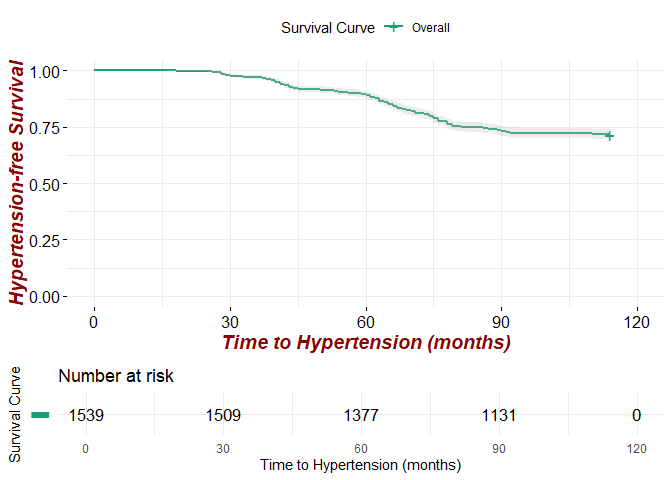<!-- -->

## **Cox Proportional Hazards Models**

``` r
# 6. Cox proportional hazards models ----

# Noise variables
noise_vars <- c("noise_night_air_bs", "noise_day_air_bs", "noise_allday_road_bs")

# Cox model for night air noise
cox_noise_night_air_bs <- coxph(surv_obj ~ I(noise_night_air_bs / 10) + age + gender + education_bs + smoke_bs + alcohol_bs + 
                                  saltconsumption_bs + exercise + bmi_bs + open_windows_bs, data = data)

# Cox model for day air noise
cox_noise_day_air_bs <- coxph(surv_obj ~ I(noise_day_air_bs / 10) + age + gender + education_bs + smoke_bs + alcohol_bs + 
                                saltconsumption_bs + exercise + bmi_bs + open_windows_bs, data = data)

# Cox model for all-day road noise
cox_noise_allday_road_bs <- coxph(surv_obj ~ I(noise_allday_road_bs / 10) + age + gender + education_bs + smoke_bs + alcohol_bs + 
                                    saltconsumption_bs + exercise + bmi_bs + open_windows_bs, data = data)

# Summaries for each Cox model
summary(cox_noise_allday_road_bs)
```

    ## Call:
    ## coxph(formula = surv_obj ~ I(noise_allday_road_bs/10) + age + 
    ##     gender + education_bs + smoke_bs + alcohol_bs + saltconsumption_bs + 
    ##     exercise + bmi_bs + open_windows_bs, data = data)
    ## 
    ##   n= 1505, number of events= 427 
    ##    (34 observations deleted due to missingness)
    ## 
    ##                                                                     coef
    ## I(noise_allday_road_bs/10)                                      0.088599
    ## age                                                             0.008799
    ## gendermale                                                     -0.081881
    ## education_bs12-15 years                                         0.264202
    ## education_bs15-18 years                                         0.271775
    ## education_bs19 years or more                                    0.271742
    ## smoke_bsSmoker                                                 -0.046114
    ## alcohol_bs                                                      0.006966
    ## saltconsumption_bssometimes,seldom.never add salt at the table  0.038565
    ## exerciseOnce a week or less                                    -0.237343
    ## exercise1-3 times a week                                       -0.021340
    ## exercise3 times a week or more                                 -0.116438
    ## bmi_bs                                                          0.022941
    ## open_windows_bsYes                                              0.124123
    ##                                                                exp(coef)
    ## I(noise_allday_road_bs/10)                                      1.092643
    ## age                                                             1.008838
    ## gendermale                                                      0.921382
    ## education_bs12-15 years                                         1.302391
    ## education_bs15-18 years                                         1.312291
    ## education_bs19 years or more                                    1.312248
    ## smoke_bsSmoker                                                  0.954933
    ## alcohol_bs                                                      1.006990
    ## saltconsumption_bssometimes,seldom.never add salt at the table  1.039318
    ## exerciseOnce a week or less                                     0.788721
    ## exercise1-3 times a week                                        0.978886
    ## exercise3 times a week or more                                  0.890085
    ## bmi_bs                                                          1.023207
    ## open_windows_bsYes                                              1.132155
    ##                                                                 se(coef)      z
    ## I(noise_allday_road_bs/10)                                      0.036434  2.432
    ## age                                                             0.004965  1.772
    ## gendermale                                                      0.097798 -0.837
    ## education_bs12-15 years                                         0.179386  1.473
    ## education_bs15-18 years                                         0.180038  1.510
    ## education_bs19 years or more                                    0.167247  1.625
    ## smoke_bsSmoker                                                  0.097780 -0.472
    ## alcohol_bs                                                      0.003897  1.788
    ## saltconsumption_bssometimes,seldom.never add salt at the table  0.097827  0.394
    ## exerciseOnce a week or less                                     0.144129 -1.647
    ## exercise1-3 times a week                                        0.126770 -0.168
    ## exercise3 times a week or more                                  0.131366 -0.886
    ## bmi_bs                                                          0.009794  2.342
    ## open_windows_bsYes                                              0.099495  1.248
    ##                                                                Pr(>|z|)  
    ## I(noise_allday_road_bs/10)                                       0.0150 *
    ## age                                                              0.0764 .
    ## gendermale                                                       0.4025  
    ## education_bs12-15 years                                          0.1408  
    ## education_bs15-18 years                                          0.1312  
    ## education_bs19 years or more                                     0.1042  
    ## smoke_bsSmoker                                                   0.6372  
    ## alcohol_bs                                                       0.0738 .
    ## saltconsumption_bssometimes,seldom.never add salt at the table   0.6934  
    ## exerciseOnce a week or less                                      0.0996 .
    ## exercise1-3 times a week                                         0.8663  
    ## exercise3 times a week or more                                   0.3754  
    ## bmi_bs                                                           0.0192 *
    ## open_windows_bsYes                                               0.2122  
    ## ---
    ## Signif. codes:  0 '***' 0.001 '**' 0.01 '*' 0.05 '.' 0.1 ' ' 1
    ## 
    ##                                                                exp(coef)
    ## I(noise_allday_road_bs/10)                                        1.0926
    ## age                                                               1.0088
    ## gendermale                                                        0.9214
    ## education_bs12-15 years                                           1.3024
    ## education_bs15-18 years                                           1.3123
    ## education_bs19 years or more                                      1.3122
    ## smoke_bsSmoker                                                    0.9549
    ## alcohol_bs                                                        1.0070
    ## saltconsumption_bssometimes,seldom.never add salt at the table    1.0393
    ## exerciseOnce a week or less                                       0.7887
    ## exercise1-3 times a week                                          0.9789
    ## exercise3 times a week or more                                    0.8901
    ## bmi_bs                                                            1.0232
    ## open_windows_bsYes                                                1.1322
    ##                                                                exp(-coef)
    ## I(noise_allday_road_bs/10)                                         0.9152
    ## age                                                                0.9912
    ## gendermale                                                         1.0853
    ## education_bs12-15 years                                            0.7678
    ## education_bs15-18 years                                            0.7620
    ## education_bs19 years or more                                       0.7621
    ## smoke_bsSmoker                                                     1.0472
    ## alcohol_bs                                                         0.9931
    ## saltconsumption_bssometimes,seldom.never add salt at the table     0.9622
    ## exerciseOnce a week or less                                        1.2679
    ## exercise1-3 times a week                                           1.0216
    ## exercise3 times a week or more                                     1.1235
    ## bmi_bs                                                             0.9773
    ## open_windows_bsYes                                                 0.8833
    ##                                                                lower .95
    ## I(noise_allday_road_bs/10)                                        1.0173
    ## age                                                               0.9991
    ## gendermale                                                        0.7607
    ## education_bs12-15 years                                           0.9163
    ## education_bs15-18 years                                           0.9221
    ## education_bs19 years or more                                      0.9455
    ## smoke_bsSmoker                                                    0.7884
    ## alcohol_bs                                                        0.9993
    ## saltconsumption_bssometimes,seldom.never add salt at the table    0.8580
    ## exerciseOnce a week or less                                       0.5946
    ## exercise1-3 times a week                                          0.7635
    ## exercise3 times a week or more                                    0.6880
    ## bmi_bs                                                            1.0038
    ## open_windows_bsYes                                                0.9316
    ##                                                                upper .95
    ## I(noise_allday_road_bs/10)                                         1.174
    ## age                                                                1.019
    ## gendermale                                                         1.116
    ## education_bs12-15 years                                            1.851
    ## education_bs15-18 years                                            1.868
    ## education_bs19 years or more                                       1.821
    ## smoke_bsSmoker                                                     1.157
    ## alcohol_bs                                                         1.015
    ## saltconsumption_bssometimes,seldom.never add salt at the table     1.259
    ## exerciseOnce a week or less                                        1.046
    ## exercise1-3 times a week                                           1.255
    ## exercise3 times a week or more                                     1.151
    ## bmi_bs                                                             1.043
    ## open_windows_bsYes                                                 1.376
    ## 
    ## Concordance= 0.569  (se = 0.013 )
    ## Likelihood ratio test= 24.55  on 14 df,   p=0.04
    ## Wald test            = 24.39  on 14 df,   p=0.04
    ## Score (logrank) test = 24.46  on 14 df,   p=0.04

``` r
summary(cox_noise_day_air_bs)
```

    ## Call:
    ## coxph(formula = surv_obj ~ I(noise_day_air_bs/10) + age + gender + 
    ##     education_bs + smoke_bs + alcohol_bs + saltconsumption_bs + 
    ##     exercise + bmi_bs + open_windows_bs, data = data)
    ## 
    ##   n= 1505, number of events= 427 
    ##    (34 observations deleted due to missingness)
    ## 
    ##                                                                     coef
    ## I(noise_day_air_bs/10)                                          0.093321
    ## age                                                             0.009305
    ## gendermale                                                     -0.082453
    ## education_bs12-15 years                                         0.256527
    ## education_bs15-18 years                                         0.273295
    ## education_bs19 years or more                                    0.266159
    ## smoke_bsSmoker                                                 -0.034546
    ## alcohol_bs                                                      0.007120
    ## saltconsumption_bssometimes,seldom.never add salt at the table  0.037030
    ## exerciseOnce a week or less                                    -0.248460
    ## exercise1-3 times a week                                       -0.026736
    ## exercise3 times a week or more                                 -0.130974
    ## bmi_bs                                                          0.021917
    ## open_windows_bsYes                                              0.108380
    ##                                                                exp(coef)
    ## I(noise_day_air_bs/10)                                          1.097814
    ## age                                                             1.009349
    ## gendermale                                                      0.920855
    ## education_bs12-15 years                                         1.292434
    ## education_bs15-18 years                                         1.314288
    ## education_bs19 years or more                                    1.304943
    ## smoke_bsSmoker                                                  0.966044
    ## alcohol_bs                                                      1.007146
    ## saltconsumption_bssometimes,seldom.never add salt at the table  1.037724
    ## exerciseOnce a week or less                                     0.780001
    ## exercise1-3 times a week                                        0.973618
    ## exercise3 times a week or more                                  0.877241
    ## bmi_bs                                                          1.022159
    ## open_windows_bsYes                                              1.114471
    ##                                                                 se(coef)      z
    ## I(noise_day_air_bs/10)                                          0.058143  1.605
    ## age                                                             0.004944  1.882
    ## gendermale                                                      0.097841 -0.843
    ## education_bs12-15 years                                         0.179282  1.431
    ## education_bs15-18 years                                         0.180225  1.516
    ## education_bs19 years or more                                    0.167186  1.592
    ## smoke_bsSmoker                                                  0.097522 -0.354
    ## alcohol_bs                                                      0.003905  1.823
    ## saltconsumption_bssometimes,seldom.never add salt at the table  0.097787  0.379
    ## exerciseOnce a week or less                                     0.144059 -1.725
    ## exercise1-3 times a week                                        0.126709 -0.211
    ## exercise3 times a week or more                                  0.131279 -0.998
    ## bmi_bs                                                          0.009724  2.254
    ## open_windows_bsYes                                              0.099178  1.093
    ##                                                                Pr(>|z|)  
    ## I(noise_day_air_bs/10)                                           0.1085  
    ## age                                                              0.0598 .
    ## gendermale                                                       0.3994  
    ## education_bs12-15 years                                          0.1525  
    ## education_bs15-18 years                                          0.1294  
    ## education_bs19 years or more                                     0.1114  
    ## smoke_bsSmoker                                                   0.7232  
    ## alcohol_bs                                                       0.0683 .
    ## saltconsumption_bssometimes,seldom.never add salt at the table   0.7049  
    ## exerciseOnce a week or less                                      0.0846 .
    ## exercise1-3 times a week                                         0.8329  
    ## exercise3 times a week or more                                   0.3184  
    ## bmi_bs                                                           0.0242 *
    ## open_windows_bsYes                                               0.2745  
    ## ---
    ## Signif. codes:  0 '***' 0.001 '**' 0.01 '*' 0.05 '.' 0.1 ' ' 1
    ## 
    ##                                                                exp(coef)
    ## I(noise_day_air_bs/10)                                            1.0978
    ## age                                                               1.0093
    ## gendermale                                                        0.9209
    ## education_bs12-15 years                                           1.2924
    ## education_bs15-18 years                                           1.3143
    ## education_bs19 years or more                                      1.3049
    ## smoke_bsSmoker                                                    0.9660
    ## alcohol_bs                                                        1.0071
    ## saltconsumption_bssometimes,seldom.never add salt at the table    1.0377
    ## exerciseOnce a week or less                                       0.7800
    ## exercise1-3 times a week                                          0.9736
    ## exercise3 times a week or more                                    0.8772
    ## bmi_bs                                                            1.0222
    ## open_windows_bsYes                                                1.1145
    ##                                                                exp(-coef)
    ## I(noise_day_air_bs/10)                                             0.9109
    ## age                                                                0.9907
    ## gendermale                                                         1.0859
    ## education_bs12-15 years                                            0.7737
    ## education_bs15-18 years                                            0.7609
    ## education_bs19 years or more                                       0.7663
    ## smoke_bsSmoker                                                     1.0352
    ## alcohol_bs                                                         0.9929
    ## saltconsumption_bssometimes,seldom.never add salt at the table     0.9636
    ## exerciseOnce a week or less                                        1.2820
    ## exercise1-3 times a week                                           1.0271
    ## exercise3 times a week or more                                     1.1399
    ## bmi_bs                                                             0.9783
    ## open_windows_bsYes                                                 0.8973
    ##                                                                lower .95
    ## I(noise_day_air_bs/10)                                            0.9796
    ## age                                                               0.9996
    ## gendermale                                                        0.7602
    ## education_bs12-15 years                                           0.9095
    ## education_bs15-18 years                                           0.9232
    ## education_bs19 years or more                                      0.9403
    ## smoke_bsSmoker                                                    0.7980
    ## alcohol_bs                                                        0.9995
    ## saltconsumption_bssometimes,seldom.never add salt at the table    0.8567
    ## exerciseOnce a week or less                                       0.5881
    ## exercise1-3 times a week                                          0.7595
    ## exercise3 times a week or more                                    0.6782
    ## bmi_bs                                                            1.0029
    ## open_windows_bsYes                                                0.9176
    ##                                                                upper .95
    ## I(noise_day_air_bs/10)                                             1.230
    ## age                                                                1.019
    ## gendermale                                                         1.116
    ## education_bs12-15 years                                            1.837
    ## education_bs15-18 years                                            1.871
    ## education_bs19 years or more                                       1.811
    ## smoke_bsSmoker                                                     1.170
    ## alcohol_bs                                                         1.015
    ## saltconsumption_bssometimes,seldom.never add salt at the table     1.257
    ## exerciseOnce a week or less                                        1.034
    ## exercise1-3 times a week                                           1.248
    ## exercise3 times a week or more                                     1.135
    ## bmi_bs                                                             1.042
    ## open_windows_bsYes                                                 1.354
    ## 
    ## Concordance= 0.565  (se = 0.013 )
    ## Likelihood ratio test= 21.23  on 14 df,   p=0.1
    ## Wald test            = 21.18  on 14 df,   p=0.1
    ## Score (logrank) test = 21.21  on 14 df,   p=0.1

``` r
summary(cox_noise_night_air_bs)
```

    ## Call:
    ## coxph(formula = surv_obj ~ I(noise_night_air_bs/10) + age + gender + 
    ##     education_bs + smoke_bs + alcohol_bs + saltconsumption_bs + 
    ##     exercise + bmi_bs + open_windows_bs, data = data)
    ## 
    ##   n= 1505, number of events= 427 
    ##    (34 observations deleted due to missingness)
    ## 
    ##                                                                     coef
    ## I(noise_night_air_bs/10)                                        0.024744
    ## age                                                             0.009230
    ## gendermale                                                     -0.079211
    ## education_bs12-15 years                                         0.255231
    ## education_bs15-18 years                                         0.259650
    ## education_bs19 years or more                                    0.261478
    ## smoke_bsSmoker                                                 -0.028726
    ## alcohol_bs                                                      0.006907
    ## saltconsumption_bssometimes,seldom.never add salt at the table  0.036609
    ## exerciseOnce a week or less                                    -0.246989
    ## exercise1-3 times a week                                       -0.026715
    ## exercise3 times a week or more                                 -0.127326
    ## bmi_bs                                                          0.021770
    ## open_windows_bsYes                                              0.103702
    ##                                                                exp(coef)
    ## I(noise_night_air_bs/10)                                        1.025052
    ## age                                                             1.009272
    ## gendermale                                                      0.923845
    ## education_bs12-15 years                                         1.290760
    ## education_bs15-18 years                                         1.296477
    ## education_bs19 years or more                                    1.298849
    ## smoke_bsSmoker                                                  0.971683
    ## alcohol_bs                                                      1.006931
    ## saltconsumption_bssometimes,seldom.never add salt at the table  1.037287
    ## exerciseOnce a week or less                                     0.781149
    ## exercise1-3 times a week                                        0.973639
    ## exercise3 times a week or more                                  0.880447
    ## bmi_bs                                                          1.022008
    ## open_windows_bsYes                                              1.109270
    ##                                                                 se(coef)      z
    ## I(noise_night_air_bs/10)                                        0.087634  0.282
    ## age                                                             0.004935  1.870
    ## gendermale                                                      0.097849 -0.810
    ## education_bs12-15 years                                         0.179278  1.424
    ## education_bs15-18 years                                         0.180084  1.442
    ## education_bs19 years or more                                    0.167252  1.563
    ## smoke_bsSmoker                                                  0.097605 -0.294
    ## alcohol_bs                                                      0.003880  1.780
    ## saltconsumption_bssometimes,seldom.never add salt at the table  0.098021  0.373
    ## exerciseOnce a week or less                                     0.144024 -1.715
    ## exercise1-3 times a week                                        0.126736 -0.211
    ## exercise3 times a week or more                                  0.131266 -0.970
    ## bmi_bs                                                          0.009681  2.249
    ## open_windows_bsYes                                              0.099144  1.046
    ##                                                                Pr(>|z|)  
    ## I(noise_night_air_bs/10)                                         0.7777  
    ## age                                                              0.0614 .
    ## gendermale                                                       0.4182  
    ## education_bs12-15 years                                          0.1545  
    ## education_bs15-18 years                                          0.1493  
    ## education_bs19 years or more                                     0.1180  
    ## smoke_bsSmoker                                                   0.7685  
    ## alcohol_bs                                                       0.0751 .
    ## saltconsumption_bssometimes,seldom.never add salt at the table   0.7088  
    ## exerciseOnce a week or less                                      0.0864 .
    ## exercise1-3 times a week                                         0.8331  
    ## exercise3 times a week or more                                   0.3321  
    ## bmi_bs                                                           0.0245 *
    ## open_windows_bsYes                                               0.2956  
    ## ---
    ## Signif. codes:  0 '***' 0.001 '**' 0.01 '*' 0.05 '.' 0.1 ' ' 1
    ## 
    ##                                                                exp(coef)
    ## I(noise_night_air_bs/10)                                          1.0251
    ## age                                                               1.0093
    ## gendermale                                                        0.9238
    ## education_bs12-15 years                                           1.2908
    ## education_bs15-18 years                                           1.2965
    ## education_bs19 years or more                                      1.2988
    ## smoke_bsSmoker                                                    0.9717
    ## alcohol_bs                                                        1.0069
    ## saltconsumption_bssometimes,seldom.never add salt at the table    1.0373
    ## exerciseOnce a week or less                                       0.7811
    ## exercise1-3 times a week                                          0.9736
    ## exercise3 times a week or more                                    0.8804
    ## bmi_bs                                                            1.0220
    ## open_windows_bsYes                                                1.1093
    ##                                                                exp(-coef)
    ## I(noise_night_air_bs/10)                                           0.9756
    ## age                                                                0.9908
    ## gendermale                                                         1.0824
    ## education_bs12-15 years                                            0.7747
    ## education_bs15-18 years                                            0.7713
    ## education_bs19 years or more                                       0.7699
    ## smoke_bsSmoker                                                     1.0291
    ## alcohol_bs                                                         0.9931
    ## saltconsumption_bssometimes,seldom.never add salt at the table     0.9641
    ## exerciseOnce a week or less                                        1.2802
    ## exercise1-3 times a week                                           1.0271
    ## exercise3 times a week or more                                     1.1358
    ## bmi_bs                                                             0.9785
    ## open_windows_bsYes                                                 0.9015
    ##                                                                lower .95
    ## I(noise_night_air_bs/10)                                          0.8633
    ## age                                                               0.9996
    ## gendermale                                                        0.7626
    ## education_bs12-15 years                                           0.9083
    ## education_bs15-18 years                                           0.9109
    ## education_bs19 years or more                                      0.9358
    ## smoke_bsSmoker                                                    0.8025
    ## alcohol_bs                                                        0.9993
    ## saltconsumption_bssometimes,seldom.never add salt at the table    0.8560
    ## exerciseOnce a week or less                                       0.5890
    ## exercise1-3 times a week                                          0.7595
    ## exercise3 times a week or more                                    0.6807
    ## bmi_bs                                                            1.0028
    ## open_windows_bsYes                                                0.9134
    ##                                                                upper .95
    ## I(noise_night_air_bs/10)                                           1.217
    ## age                                                                1.019
    ## gendermale                                                         1.119
    ## education_bs12-15 years                                            1.834
    ## education_bs15-18 years                                            1.845
    ## education_bs19 years or more                                       1.803
    ## smoke_bsSmoker                                                     1.177
    ## alcohol_bs                                                         1.015
    ## saltconsumption_bssometimes,seldom.never add salt at the table     1.257
    ## exerciseOnce a week or less                                        1.036
    ## exercise1-3 times a week                                           1.248
    ## exercise3 times a week or more                                     1.139
    ## bmi_bs                                                             1.042
    ## open_windows_bsYes                                                 1.347
    ## 
    ## Concordance= 0.564  (se = 0.013 )
    ## Likelihood ratio test= 18.7  on 14 df,   p=0.2
    ## Wald test            = 18.75  on 14 df,   p=0.2
    ## Score (logrank) test = 18.78  on 14 df,   p=0.2

``` r
# Store models in a list
models_cont <- list(noise_night_air_bs = cox_noise_night_air_bs,
                    noise_day_air_bs = cox_noise_day_air_bs,
                    noise_allday_road_bs = cox_noise_allday_road_bs)

# Create tidy models
tidy_model_night <- tidy(models_cont$noise_night_air_bs, exponentiate = TRUE, conf.int = TRUE)
tidy_model_day <- tidy(models_cont$noise_day_air_bs, exponentiate = TRUE, conf.int = TRUE)
tidy_model_allday <- tidy(models_cont$noise_allday_road_bs, exponentiate = TRUE, conf.int = TRUE)
```

## **Helper Function for Forest Plots**

``` r
# Variable descriptions
labels <- c(
  "I(noise_night_air_bs/10)"        = "Night-time aircraft noise (per 10 dB)",
  "I(noise_day_air_bs/10)"          = "Day-time aircraft noise (per 10 dB)",
  "I(noise_allday_road_bs/10)"      = "All-day road noise (per 10 dB)",
  "age"                             = "Age",
  "gendermale"                      = "Gender: male vs female",
  "education_bs12-15 years"         = "Education: 12–15 y vs ≤12 y",
  "education_bs15-18 years"         = "Education: 15–18 y vs ≤12 y",
  "education_bs19 years or more"    = "Education: ≥19 y vs ≤12 y",
  "smoke_bsSmoker"                  = "Smoking (current)",
  "alcohol_bs"                      = "Alcohol units / week",
  "saltconsumption_bssometimes,seldom.never add salt at the table"
  = "Adds salt (seldom/never) vs always",
  "exerciseOnce a week or less"     = "Exercise ≤1×/week vs never",
  "exercise1-3 times a week"        = "Exercise 1–3×/week vs never",
  "exercise3 times a week or more"  = "Exercise ≥3×/week vs never",
  "bmi_bs"                          = "Body-mass index",
  "open_windows_bsYes"              = "Habitual window-opening"
)

# Function to create forest plot
create_forest_plot <- function(tidy_model, title){
  tidy_model %>%
    filter(term != "(Intercept)") %>%
    mutate(
      term  = ifelse(term %in% names(labels), labels[term], term),
      color = ifelse(p.value < 0.05, "blue", "red")
    ) %>%
    ggplot(aes(estimate, term, color = color)) +
    geom_point() +
    geom_errorbarh(aes(xmin = conf.low, xmax = conf.high), height = 0.2) +
    geom_vline(xintercept = 1, linetype = "dashed") +
    scale_color_identity() +
    labs(x = "Hazard ratio (per 10 dB)", y = NULL, title = title) +
    theme_minimal() +
    scale_color_identity() +
    geom_text(aes(label = round(p.value, 3)), x = 0.3, hjust = -0.2) +
    xlim(min(tidy_model$conf.low, na.rm = TRUE) - 0.3, max(tidy_model$conf.high, na.rm = TRUE) + 0.3) +
    theme(legend.position = "bottom") +
    guides(color = guide_legend(override.aes = list(color = c("blue", "red")), title = "Significance: ")) +
    scale_color_manual(values = c("blue" = "blue", "red" = "red"), labels = c("Significant", "Not Significant"))
}

# Create forest plots
create_forest_plot(tidy_model_night, "Night-Air Analysis")
```

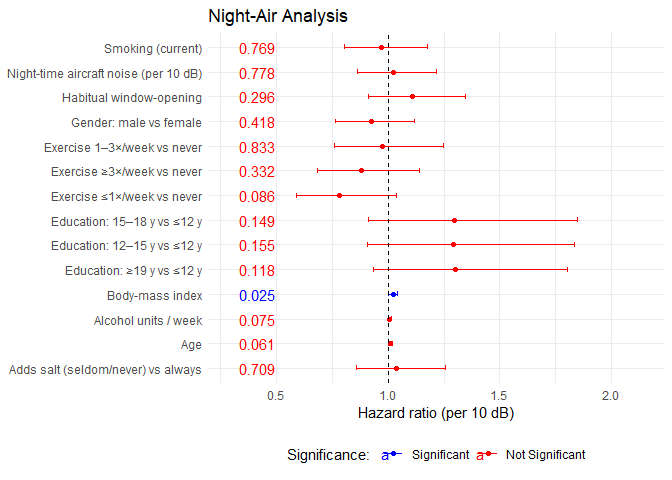<!-- -->

``` r
create_forest_plot(tidy_model_day, "Day-Air Analysis")
```

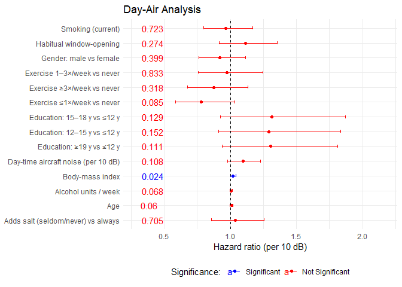<!-- -->

``` r
create_forest_plot(tidy_model_allday, "Allday-Road Analysis")
```

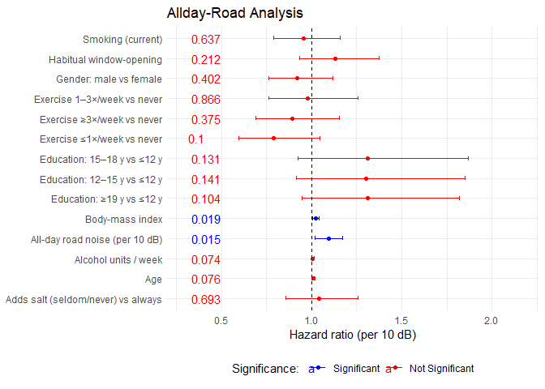<!-- -->

## **Visualize Model Results (Forest Plots)**

``` r
# 7. Diagnostics ----

# Diagnostics for noise_night_air_bs
cox.zph(models_cont$noise_night_air_bs) # Proportional hazards test
```

    ##                            chisq df     p
    ## I(noise_night_air_bs/10)  0.0126  1 0.911
    ## age                       0.4239  1 0.515
    ## gender                    0.6044  1 0.437
    ## education_bs              1.7912  3 0.617
    ## smoke_bs                  0.0568  1 0.812
    ## alcohol_bs                1.5337  1 0.216
    ## saltconsumption_bs        1.5725  1 0.210
    ## exercise                  2.6116  3 0.455
    ## bmi_bs                    3.5809  1 0.058
    ## open_windows_bs           0.4725  1 0.492
    ## GLOBAL                   12.2497 14 0.586

``` r
ggcoxzph(cox.zph(models_cont$noise_night_air_bs)) # Plot proportional hazards
```

<!-- -->

``` r
ggcoxdiagnostics(models_cont$noise_night_air_bs, type = "dfbeta") # DFBeta plot
```

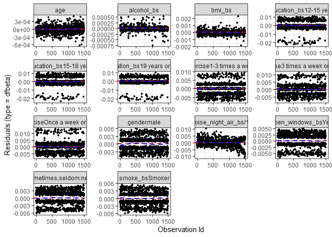<!-- -->

``` r
ggcoxdiagnostics(models_cont$noise_night_air_bs, type = "deviance") # Deviance plot
```

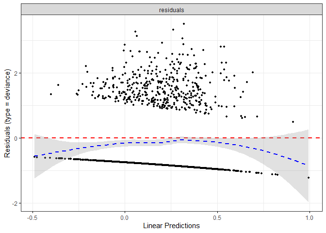<!-- -->

``` r
# Diagnostics for noise_day_air_bs
cox.zph(models_cont$noise_day_air_bs) # Proportional hazards test
```

    ##                          chisq df     p
    ## I(noise_day_air_bs/10)  0.1947  1 0.659
    ## age                     0.4318  1 0.511
    ## gender                  0.5910  1 0.442
    ## education_bs            1.8052  3 0.614
    ## smoke_bs                0.0567  1 0.812
    ## alcohol_bs              1.5697  1 0.210
    ## saltconsumption_bs      1.5566  1 0.212
    ## exercise                2.6168  3 0.455
    ## bmi_bs                  3.6031  1 0.058
    ## open_windows_bs         0.4654  1 0.495
    ## GLOBAL                 12.4435 14 0.571

``` r
ggcoxzph(cox.zph(models_cont$noise_day_air_bs)) # Plot proportional hazards
```

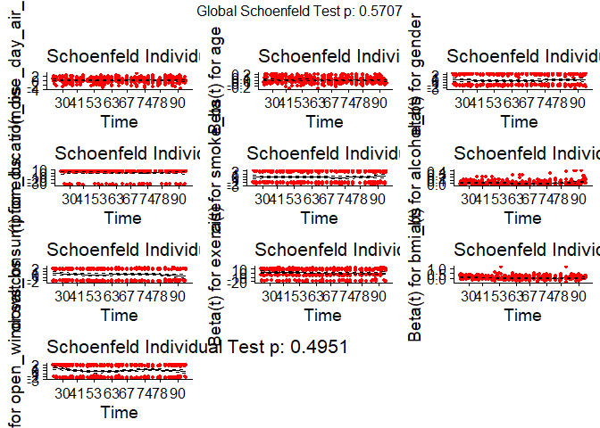<!-- -->

``` r
ggcoxdiagnostics(models_cont$noise_day_air_bs, type = "dfbeta") # DFBeta plot
```

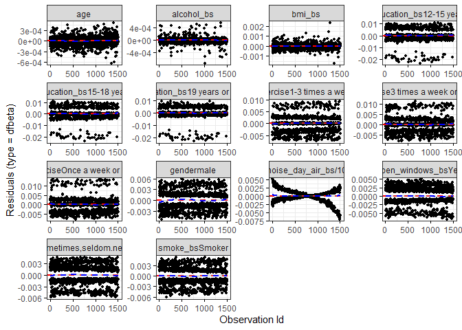<!-- -->

``` r
ggcoxdiagnostics(models_cont$noise_day_air_bs, type = "deviance") # Deviance plot
```

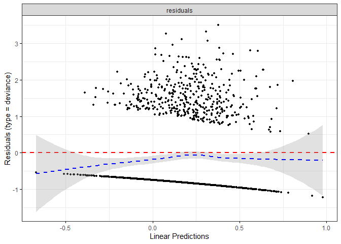<!-- -->

``` r
# Diagnostics for noise_allday_road_bs
cox.zph(models_cont$noise_allday_road_bs) # Proportional hazards test
```

    ##                              chisq df     p
    ## I(noise_allday_road_bs/10)  2.3397  1 0.126
    ## age                         0.4188  1 0.518
    ## gender                      0.5898  1 0.443
    ## education_bs                1.8379  3 0.607
    ## smoke_bs                    0.0573  1 0.811
    ## alcohol_bs                  1.5821  1 0.208
    ## saltconsumption_bs          1.5234  1 0.217
    ## exercise                    2.6611  3 0.447
    ## bmi_bs                      3.6616  1 0.056
    ## open_windows_bs             0.4553  1 0.500
    ## GLOBAL                     14.4539 14 0.416

``` r
ggcoxzph(cox.zph(models_cont$noise_allday_road_bs)) # Plot proportional hazards
```

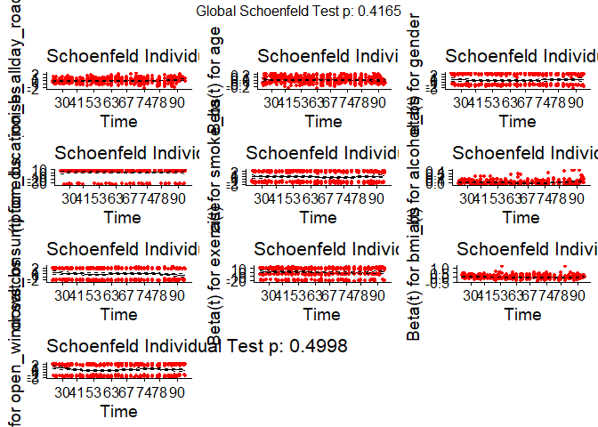<!-- -->

``` r
ggcoxdiagnostics(models_cont$noise_allday_road_bs, type = "dfbeta") # DFBeta plot
```

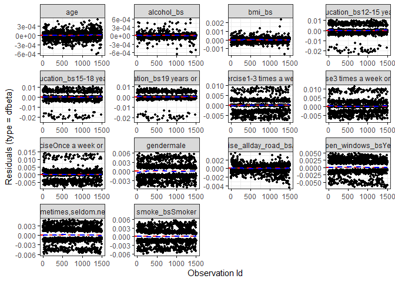<!-- -->

``` r
ggcoxdiagnostics(models_cont$noise_allday_road_bs, type = "deviance") # Deviance plot
```

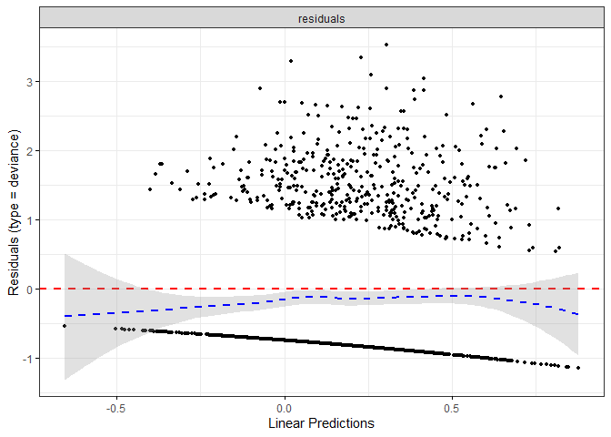<!-- -->

``` r
# VIF for the design matrix
vif(cox_noise_allday_road_bs) # Calculate VIF
```

    ##                                GVIF Df GVIF^(1/(2*Df))
    ## I(noise_allday_road_bs/10) 1.018686  1        1.009300
    ## age                        1.015013  1        1.007478
    ## gender                     1.018500  1        1.009208
    ## education_bs               1.017767  3        1.002939
    ## smoke_bs                   1.018137  1        1.009028
    ## alcohol_bs                 1.025942  1        1.012888
    ## saltconsumption_bs         1.008132  1        1.004058
    ## exercise                   1.022094  3        1.003649
    ## bmi_bs                     1.013019  1        1.006488
    ## open_windows_bs            1.016772  1        1.008351

``` r
vif(cox_noise_day_air_bs)
```

    ##                            GVIF Df GVIF^(1/(2*Df))
    ## I(noise_day_air_bs/10) 1.009604  1        1.004790
    ## age                    1.014749  1        1.007347
    ## gender                 1.019398  1        1.009652
    ## education_bs           1.020736  3        1.003426
    ## smoke_bs               1.012760  1        1.006360
    ## alcohol_bs             1.027112  1        1.013465
    ## saltconsumption_bs     1.007315  1        1.003651
    ## exercise               1.019897  3        1.003289
    ## bmi_bs                 1.009437  1        1.004707
    ## open_windows_bs        1.010314  1        1.005144

``` r
vif(cox_noise_night_air_bs)
```

    ##                              GVIF Df GVIF^(1/(2*Df))
    ## I(noise_night_air_bs/10) 1.018936  1        1.009424
    ## age                      1.016262  1        1.008098
    ## gender                   1.019563  1        1.009734
    ## education_bs             1.018886  3        1.003123
    ## smoke_bs                 1.014501  1        1.007224
    ## alcohol_bs               1.027352  1        1.013584
    ## saltconsumption_bs       1.012141  1        1.006052
    ## exercise                 1.019732  3        1.003262
    ## bmi_bs                   1.012254  1        1.006108
    ## open_windows_bs          1.009623  1        1.004800
